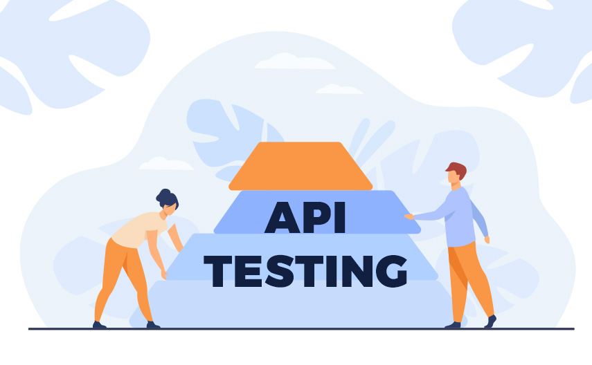
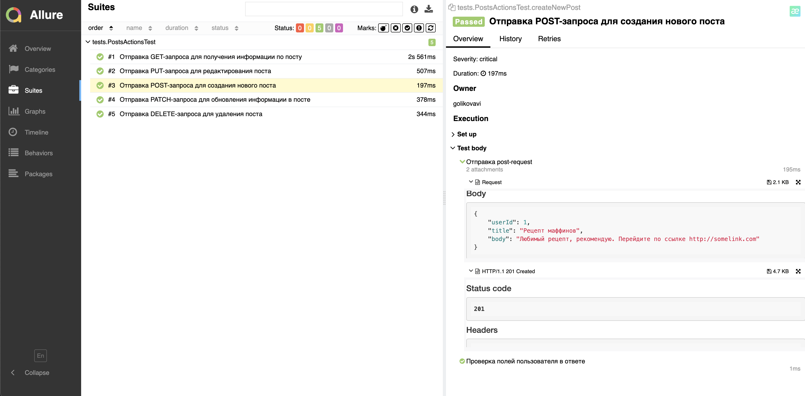

## Проект по автоматизации тестирования API
### Веб сайт <a target="_blank" href="https://jsonplaceholder.typicode.com/">{JSON} Placeholder</a>

<p align="center">

</p>


## :rocket: Содержание:

- Технологии и инструменты
- Список методов, на которые были реализованы тесты
- Запуск тестов (сборка в Jenkins)
- Allure-отчет
- Интеграция с Allure TestOps
- Уведомление в Telegram о результатах прогона тестов

## :rocket: Технологии и инструменты

<p align="center">
<a href="https://www.jetbrains.com/idea/"></a>
<a href="https://www.java.com/"></a>
<a href="https://github.com/"></a>
<a href="https://junit.org/junit5/"></a>
<a href="https://gradle.org/"></a>
<a href="https://github.com/allure-framework/allure2"></a>
<a href="https://qameta.io/"></a>
<a href="https://www.jenkins.io/"></a>
</p>

## :rocket:  Список тестов и проверок

- [x] getPostInformation - получение информации поста по его id
- [x] createNewPost - создание нового поста
- [x] updatePost - редактирование информации в посте
- [x] patchResource - обновление ирформации в посте
- [x] deleteResource - удаление поста по id

###  Локальный запуск :
Пример командной строки:
```bash
gradle clean test  
```

Получение отчёта:
```bash
allure serve build/allure-results
```

###  :rocket:  Удаленный запуск (в Jenkins):
1. Открыть <a target="_blank" href="https://jenkins.autotests.cloud/job/24-ShocoArts-JSONPlaceholder/">проект</a> и нажать **Build with Parameters**


###  Отчет в Allure report


**Статус прогона тестов в диаграммах**


**Тесты**

<p align="center">

</p>

## :rocket: Интеграция с Allure TestOps


## :rocket: Получение отчетов о прохождении тестов в telegram


